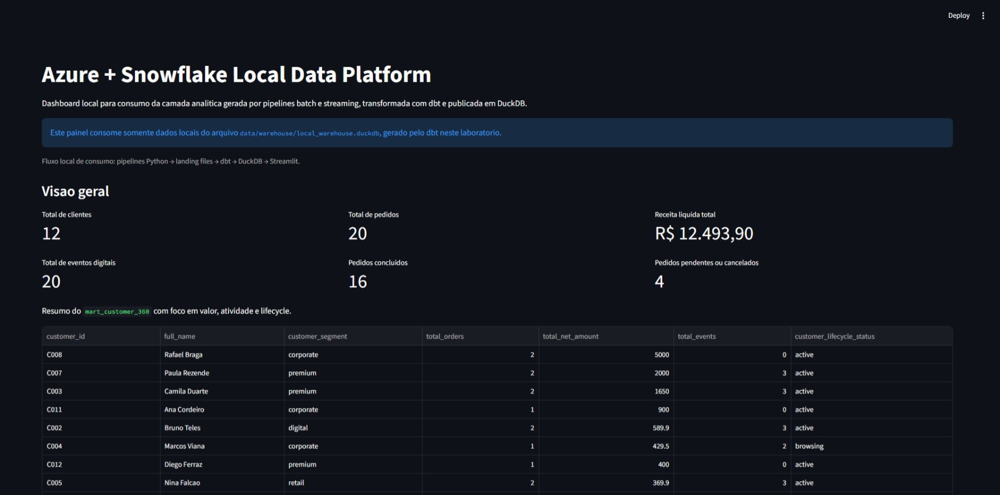
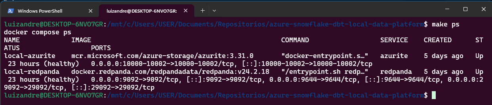
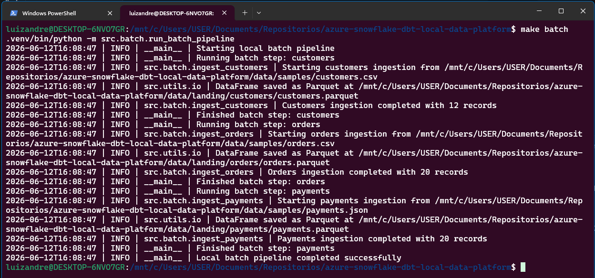
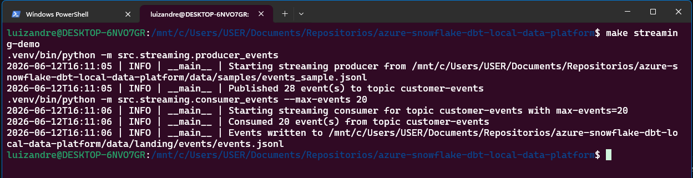
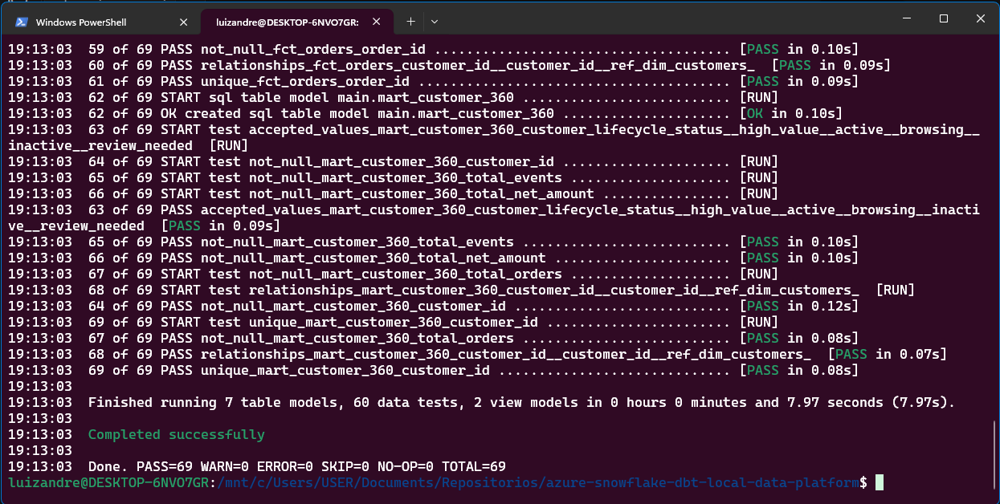
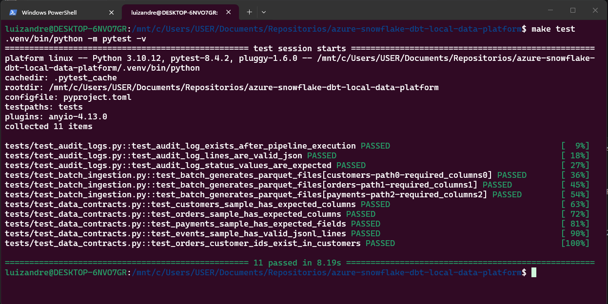
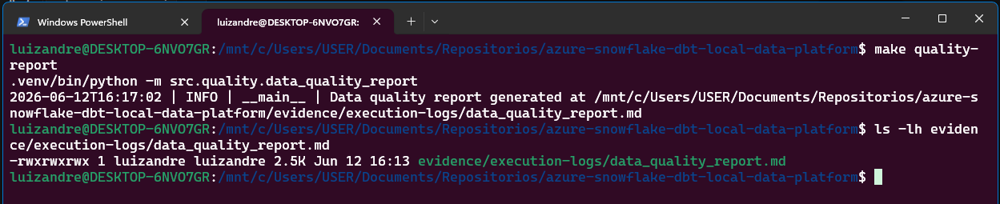

<div align="center">

# azure-snowflake-dbt-local-data-platform

Laboratorio local-first de Engenharia de Dados para demonstrar, em um repositorio unico, uma plataforma inspirada em Azure + Snowflake com batch, streaming, dbt, DuckDB, qualidade de dados, dashboard e CI/CD.

[](https://github.com/brodyandre/azure-snowflake-dbt-local-data-platform/actions/workflows/ci.yml)
[](https://github.com/brodyandre/azure-snowflake-dbt-local-data-platform/actions/workflows/dbt-validation.yml)
[](https://github.com/brodyandre/azure-snowflake-dbt-local-data-platform/actions/workflows/docs-validation.yml)

<br />


<br />

<a href="#como-executar-localmente"><strong>Executar localmente</strong></a>
&nbsp;|&nbsp;
<a href="docs/architecture.md"><strong>Arquitetura</strong></a>
&nbsp;|&nbsp;
<a href="#pipeline-batch"><strong>Batch</strong></a>
&nbsp;|&nbsp;
<a href="#pipeline-streaming"><strong>Streaming</strong></a>
&nbsp;|&nbsp;
<a href="#dashboard-local"><strong>Dashboard</strong></a>
&nbsp;|&nbsp;
<a href="#evidencias-de-execucao"><strong>Evidencias</strong></a>

</div>

<p align="center">
  
</p>

> Projeto demonstrativo, local-first e cloud-compatible.
> Usa DuckDB como warehouse local, Azurite para simular Azure Blob Storage e Redpanda para representar um fluxo inspirado em Azure Event Hubs/Kafka.
> Nao usa Azure real nem Snowflake real.

<a id="indice"></a>

<details>
<summary><strong>Indice completo</strong></summary>

- [Visao geral](#visao-geral)
- [Resumo executivo](#resumo-executivo)
- [Objetivo do projeto](#objetivo-do-projeto)
- [Responsabilidades da vaga demonstradas pelo projeto](#responsabilidades-da-vaga)
- [Arquitetura local](#arquitetura-local)
- [Tecnologias utilizadas](#tecnologias-utilizadas)
- [Como este projeto simula Azure + Snowflake localmente](#simulacao-azure-snowflake)
- [Limitacoes conhecidas](#limitacoes-conhecidas)
- [Como executar localmente](#como-executar-localmente)
- [Ambiente Python no WSL2](#ambiente-python-no-wsl2)
- [Servicos locais com Docker Compose](#servicos-locais)
- [Fontes de dados simuladas](#fontes-de-dados)
- [Pipeline batch](#pipeline-batch)
- [Pipeline streaming](#pipeline-streaming)
- [Transformacoes com dbt](#transformacoes-com-dbt)
- [Modelagem analitica](#modelagem-analitica)
- [Qualidade de dados](#qualidade-de-dados)
- [SQL e compatibilidade com Snowflake](#sql-e-compatibilidade-com-snowflake)
- [Dashboard local](#dashboard-local)
- [CI/CD com GitHub Actions](#ci-cd-com-github-actions)
- [Governanca de dados](#governanca-de-dados)
- [Evidencias de execucao](#evidencias-de-execucao)
- [Troubleshooting](#troubleshooting)
- [Proximos passos](#proximos-passos)
- [Autor](#autor)

</details>

<a id="visao-geral"></a>

## Visao geral

Este repositorio e um laboratorio local-first de Engenharia de Dados criado para simular, com ferramentas gratuitas e executaveis localmente, uma arquitetura inspirada em Azure + Snowflake. O projeto cobre ingestao batch, ingestao streaming, transformacoes com dbt, consumo analitico em DuckDB, dashboard com Streamlit, qualidade de dados, SQL analitico e validacoes com GitHub Actions.

O foco nao e reproduzir a nuvem produto a produto. O foco e demonstrar organizacao tecnica, boas praticas de engenharia, clareza de arquitetura e disciplina de validacao em um ambiente simples de subir no WSL2.

Documentacao complementar:

- [Arquitetura](docs/architecture.md)
- [Requisitos de negocio](docs/business_requirements.md)
- [Contratos de dados](docs/data_contracts.md)
- [Governanca de dados](docs/data_governance.md)
- [Migracao para Azure + Snowflake](docs/migration_to_azure_snowflake.md)
- [Troubleshooting](docs/troubleshooting.md)
- [Status do projeto](docs/project_status.md)

[Voltar ao indice](#indice)

<a id="resumo-executivo"></a>

## Resumo executivo

| Pilar | O que o repositorio demonstra | Stack local |
| --- | --- | --- |
| Ingestao batch | Leitura de fontes CSV/JSON, validacao minima e publicacao em parquet | Python, pandas, PyArrow |
| Streaming | Producer e consumer Kafka-compatible para eventos sinteticos | Redpanda, JSONL |
| Modelagem analitica | Organizacao em `staging`, `intermediate` e `marts` | dbt Core, DuckDB |
| Qualidade e governanca | Contratos, testes, auditoria e relatorio operacional | pytest, dbt tests, JSONL audit |
| Consumo analitico | Dashboard local com KPIs e visoes derivadas dos marts | Streamlit, SQL, DuckDB |
| CI/CD | Validacoes automatizadas para Python, dbt e documentacao | GitHub Actions, Makefile |

### O que torna este laboratorio forte no GitHub

- demonstra uma arquitetura end-to-end sem depender de cloud paga
- conecta ingestao, transformacao, qualidade, consumo e CI/CD no mesmo repositorio
- usa ferramentas reconhecidas no mercado com mapeamento conceitual para Azure + Snowflake
- inclui evidencias reais de execucao, logs operacionais e documentacao de migracao

[Voltar ao indice](#indice)

<a id="objetivo-do-projeto"></a>

## Objetivo do projeto

Construir um ambiente tecnico reproduzivel para demonstrar praticas de Engenharia de Dados local-first com desenho cloud-compatible. Isso inclui:

- ingestao e preparo de dados por pipelines Python
- simulacao de eventos em streaming
- organizacao da camada analitica com dbt
- uso do DuckDB como warehouse local
- consultas SQL e modelos analiticos com foco em negocio
- testes automatizados, relatorio de qualidade e CI/CD
- camada simples de consumo com Streamlit

[Voltar ao indice](#indice)

<a id="responsabilidades-da-vaga"></a>

## Responsabilidades da vaga demonstradas pelo projeto

| Requisito da vaga | Como o projeto demonstra | Arquivos ou componentes relacionados |
| --- | --- | --- |
| Engenharia de dados em ambiente cloud | Simula desenho de dados inspirado em Azure + Snowflake, mas com execucao local e sem credenciais reais | `docs/architecture.md`, `docs/migration_to_azure_snowflake.md`, `docker-compose.yml` |
| Pipelines batch | Processa fontes CSV e JSON, valida colunas obrigatorias e publica parquet na landing | `src/batch/`, `Makefile`, `data/samples/` |
| Pipelines streaming | Publica e consome eventos sinteticos para demonstrar ingestao orientada a eventos | `src/streaming/`, `make streaming-demo`, `data/landing/events/events.jsonl` |
| ETL/ELT | Separa ingestao Python da transformacao analitica com dbt sobre DuckDB | `src/batch/`, `dbt/models/`, `data/warehouse/local_warehouse.duckdb` |
| Azure-inspired architecture | Usa Azurite, Redpanda, DuckDB e dbt para representar conceitos equivalentes de storage, streaming e analytics | `docker-compose.yml`, `docs/architecture.md` |
| Snowflake-compatible SQL | Mantem exemplos de DDL, schemas, procedures e queries analiticas em sintaxe orientada a Snowflake | `sql/snowflake_compatible/`, `sql/analytical_queries/` |
| dbt | Organiza a camada analitica em `staging`, `intermediate` e `marts`, com testes e materializacoes controladas | `dbt/dbt_project.yml`, `dbt/models/` |
| Qualidade de dados | Usa testes dbt, testes Python e relatorio operacional consolidado | `tests/`, `dbt/models/*/schema.yml`, `src/quality/data_quality_report.py` |
| Governanca | Documenta contratos, rastreabilidade, auditoria e controles locais de evolucao | `docs/data_contracts.md`, `docs/data_governance.md`, `evidence/execution-logs/` |
| SQL analitico | Responde perguntas de receita, segmentacao, pagamento e customer 360 | `sql/analytical_queries/`, `dbt/models/marts/` |
| CI/CD | Valida Python, dbt e documentacao com workflows simples e reproduziveis | `.github/workflows/`, `Makefile` |
| DevOps | Padroniza comandos locais, automacao e validacoes sem depender de cloud real | `Makefile`, `.github/workflows/`, `docs/troubleshooting.md` |
| Dashboard analitico | Consome o DuckDB local em uma interface objetiva para leitura de KPIs e tabelas analiticas | `dashboard/app.py` |
| POC local | Reune infraestrutura, dados sinteticos, testes, SQL e dashboard em um laboratorio unico e demonstravel | repositorio completo |

[Voltar ao indice](#indice)

<a id="arquitetura-local"></a>

## Arquitetura local

Fluxo principal do laboratorio:

```text
Fontes simuladas
→ data/samples
→ pipelines Python
→ data/landing
→ dbt staging tables
→ dbt intermediate
→ dbt marts
→ DuckDB local
→ Streamlit dashboard
→ GitHub Actions
```

Esse desenho ajuda a explicar a separacao entre ingestao, transformacao, consumo e validacao continua, mesmo sem usar Azure real nem Snowflake real nesta fase.

[Voltar ao indice](#indice)

<a id="tecnologias-utilizadas"></a>

## Tecnologias utilizadas

| Categoria | Tecnologias |
| --- | --- |
| Linguagem e utilitarios | Python, pathlib, pandas, PyArrow, python-dotenv |
| Armazenamento e analytics | DuckDB como warehouse local |
| Transformacao | dbt Core com adapter DuckDB |
| Streaming | Redpanda como broker Kafka-compatible |
| Simulacao de storage cloud | Azurite para Blob Storage local |
| Consumo | Streamlit para dashboard analitico |
| Qualidade | pytest, dbt tests, relatorio de qualidade |
| Automacao | Makefile, Docker Compose, GitHub Actions |
| SQL | consultas analiticas e scripts compativeis com Snowflake |

[Voltar ao indice](#indice)

<a id="simulacao-azure-snowflake"></a>

## Como este projeto simula Azure + Snowflake localmente

| Componente local | Equivalente conceitual | Papel no laboratorio |
| --- | --- | --- |
| Azurite | Azure Blob Storage / ADLS Gen2 | Representar landing zone e armazenamento de artefatos |
| Redpanda | Azure Event Hubs / Kafka | Representar publicacao e consumo de eventos |
| DuckDB | Snowflake | Representar a camada analitica local |
| dbt + DuckDB | dbt + Snowflake | Representar modelagem em camadas, testes e promocao de modelos |
| GitHub Actions | GitHub Actions / Azure DevOps | Representar automacao de validacao e esteira CI/CD |

[Voltar ao indice](#indice)

<a id="limitacoes-conhecidas"></a>

## Limitacoes conhecidas

- O projeto nao executa Azure real nem Snowflake real localmente.
- O fluxo streaming em CI nao sobe broker; usa preparo de arquivos para manter a validacao simples.
- O ambiente local nao replica elasticidade, seguranca gerenciada, custo e operacao de uma plataforma cloud real.
- Novas evidencias visuais dependem de captura manual e versionamento pelo mantenedor quando houver novas entregas.

[Voltar ao indice](#indice)

<a id="como-executar-localmente"></a>

## Como executar localmente

Roteiro recomendado para demonstracao completa do laboratorio:

1. subir a infraestrutura local
2. executar a ingestao batch
3. publicar e consumir eventos
4. construir os modelos dbt
5. validar testes e relatorio de qualidade
6. abrir o dashboard

```bash
make up
make batch
make streaming-demo
make dbt-build
make test
make quality-report
make dashboard
```

Atalhos uteis para validacao rapida:

```bash
make ci-python
make ci-dbt
make ci-docs
make down
```

[Voltar ao indice](#indice)

<a id="ambiente-python-no-wsl2"></a>

## Ambiente Python no WSL2

Em WSL2, o interpretador mais comum e `python3`. O preparo recomendado do ambiente local e:

```bash
python3 -m venv .venv
source .venv/bin/activate
python -m pip install --upgrade pip
pip install -r requirements.txt
python -m compileall src dashboard
```

Quando a `.venv` existe, o `Makefile` passa a preferir automaticamente `.venv/bin/python`, o que ajuda a manter o fluxo local consistente.

[Voltar ao indice](#indice)

<a id="servicos-locais"></a>

## Servicos locais com Docker Compose

Os servicos locais suportam a demonstracao de armazenamento, streaming e observabilidade operacional.

| Servico | Funcao | Portas |
| --- | --- | --- |
| Azurite | Simula object storage e landing zone | `10000`, `10001`, `10002` |
| Redpanda | Broker Kafka-compatible para eventos | `9092`, `29092`, `9644` |
| Redpanda Console | Inspecao visual do broker e topicos | `8080` |

Comandos:

```bash
make up
make ps
make logs
make down
```

Evidencia da infraestrutura local em execucao no Docker Compose:



[Voltar ao indice](#indice)

<a id="fontes-de-dados"></a>

## Fontes de dados simuladas

| Fonte | Formato | Papel no laboratorio |
| --- | --- | --- |
| `data/samples/customers.csv` | CSV | Cadastro sintetico de clientes |
| `data/samples/orders.csv` | CSV | Pedidos multicanal e metricas comerciais |
| `data/samples/payments.json` | JSON | Status de pagamento, falha, pendencia e estorno |
| `data/samples/events_sample.jsonl` | JSON Lines | Eventos digitais para navegacao, conversao e suporte |

[Voltar ao indice](#indice)

<a id="pipeline-batch"></a>

## Pipeline batch

O pipeline batch le as fontes estruturadas, aplica validacoes minimas e grava a camada `landing` em parquet.

Entradas:

- `customers.csv`
- `orders.csv`
- `payments.json`

Saidas:

- `data/landing/customers/customers.parquet`
- `data/landing/orders/orders.parquet`
- `data/landing/payments/payments.parquet`

Comando:

```bash
make batch
```

Validacoes principais:

- colunas obrigatorias
- IDs obrigatorios
- tipagem de datas
- tipagem de valores monetarios
- remocao de espacos em campos textuais
- geracao de `net_amount`
- auditoria em `evidence/execution-logs/pipeline_audit.jsonl`

Evidencia da execucao bem-sucedida do pipeline batch:



[Voltar ao indice](#indice)

<a id="pipeline-streaming"></a>

## Pipeline streaming

O pipeline streaming demonstra publicacao e consumo de eventos locais com Redpanda, sem dependencia de cloud real.

Fluxo:

`events_sample.jsonl` -> producer -> topic `customer-events` -> consumer -> `data/landing/events/events.jsonl`

Comandos:

```bash
make streaming-producer
make streaming-consumer
make streaming-demo
```

Evidencia do fluxo streaming local com producer e consumer:



[Voltar ao indice](#indice)

<a id="transformacoes-com-dbt"></a>

## Transformacoes com dbt

O dbt organiza a camada analitica sobre o DuckDB local.

Camadas:

- `staging`: limpeza, padronizacao e tipagem inicial
- `intermediate`: combinacoes e regras reutilizaveis
- `marts`: tabelas finais para consumo analitico

Comandos:

```bash
make dbt-debug
make dbt-run
make dbt-test
make dbt-build
```

Observacao importante: os modelos `staging` que leem arquivos da landing foram materializados como `table` para evitar problemas de resolucao de caminhos relativos quando o DuckDB e consultado por ferramentas externas, como o dashboard Streamlit.

Evidencia do `dbt build` executado com sucesso:



[Voltar ao indice](#indice)

<a id="modelagem-analitica"></a>

## Modelagem analitica

| Modelo | Camada | Tipo | Finalidade |
| --- | --- | --- | --- |
| `stg_customers` | staging | table | Padronizar atributos cadastrais |
| `stg_orders` | staging | table | Padronizar pedidos e valores comerciais |
| `stg_payments` | staging | table | Padronizar pagamentos e seus status |
| `stg_events` | staging | table | Padronizar eventos digitais |
| `int_orders_enriched` | intermediate | view | Enriquecer pedidos com sinais de pagamento |
| `int_customer_events` | intermediate | view | Agregar eventos por cliente |
| `dim_customers` | marts | table | Publicar dimensao de clientes |
| `fct_orders` | marts | table | Publicar fato de pedidos |
| `mart_customer_360` | marts | table | Consolidar relacionamento, receita e engajamento |

[Voltar ao indice](#indice)

<a id="qualidade-de-dados"></a>

## Qualidade de dados

O projeto combina validacoes em dois niveis:

- testes dbt para integridade analitica
- testes Python para contratos, landing e auditoria

O relatorio de qualidade fica em:

- `evidence/execution-logs/data_quality_report.md`

Comandos:

```bash
make test
make quality-report
```

Evidencia da suite Python aprovada:



Evidencia da geracao do relatorio de qualidade:



[Voltar ao indice](#indice)

<a id="sql-e-compatibilidade-com-snowflake"></a>

## SQL e compatibilidade com Snowflake

A pasta `sql/` concentra dois tipos de artefato:

- consultas analiticas voltadas ao consumo e exploracao do modelo de negocio
- scripts conceituais de migracao para um ambiente Snowflake real

O projeto nao executa Snowflake localmente. O warehouse local continua sendo o DuckDB. Por isso, os arquivos em `sql/snowflake_compatible/` existem como referencia de arquitetura, demonstracao de conhecimento e apoio a uma futura migracao, sem afirmar que Snowflake roda neste laboratorio.

Finalidade das subpastas:

- `sql/snowflake_compatible/`: DDLs, schemas, tabelas e exemplos operacionais em sintaxe proxima de Snowflake
- `sql/analytical_queries/`: consultas legiveis para responder perguntas de negocio sobre clientes, canais, pagamentos e engajamento

Diferenca entre os dois grupos:

- os scripts conceituais de Snowflake documentam como o ambiente cloud poderia ser estruturado
- as consultas analiticas refletem o consumo do modelo atual e podem servir como referencia para leitura no DuckDB ou em um futuro alvo Snowflake

Arquivos principais:

- `create_database.sql`
- `create_schemas.sql`
- `create_tables.sql`
- `procedures_examples.sql`

Consultas analiticas:

- `customer_360.sql`
- `revenue_by_channel.sql`
- `payment_quality_summary.sql`
- `customer_engagement_summary.sql`

[Voltar ao indice](#indice)

<a id="dashboard-local"></a>

## Dashboard local

O dashboard em Streamlit fecha o ciclo de consumo do laboratorio usando o DuckDB local como fonte analitica.

Modelos consultados:

- `mart_customer_360`
- `fct_orders`
- `dim_customers`
- `int_customer_events`

Comandos:

```bash
make batch
make streaming-demo
make dbt-build
make dashboard
```

URL esperada:

- `http://localhost:8501`

Evidencia do dashboard analitico local em execucao:


[Voltar ao indice](#indice)

<a id="ci-cd-com-github-actions"></a>

## CI/CD com GitHub Actions

Os workflows validam o projeto automaticamente sem depender de Azure real, Snowflake real, secrets ou servicos obrigatorios de infraestrutura no runner.

Workflows:

- `CI - Python Validation`: `compileall`, batch, testes Python e relatorio de qualidade
- `CI - dbt Validation`: batch, `prepare-dbt-inputs`, `dbt debug` e `dbt build`
- `CI - Documentation Validation`: presenca da documentacao e dos arquivos centrais do repositorio

Diferenca entre validacao local e validacao em CI:

- localmente, o fluxo completo pode usar `make streaming-demo` com Redpanda
- em CI, o projeto evita Docker e broker para manter a validacao simples e estavel

Por que o CI usa `prepare-dbt-inputs`:

- o `dbt build` precisa de `data/landing/events/events.jsonl`
- em CI, esse arquivo e preparado a partir de `data/samples/events_sample.jsonl`
- isso reduz dependencias externas e mantem a validacao reprodutivel

Comandos locais equivalentes:

```bash
make ci-python
make ci-dbt
make ci-docs
```

[Voltar ao indice](#indice)

<a id="governanca-de-dados"></a>

## Governanca de dados

O laboratorio documenta contratos, regras minimas de qualidade, auditoria e rastreabilidade para manter a evolucao tecnica controlada.

Leituras principais:

- [Contratos de dados](docs/data_contracts.md)
- [Governanca de dados](docs/data_governance.md)

Elementos praticos ja presentes:

- contratos das fontes sinteticas
- testes automatizados dbt e pytest
- relatorio de qualidade
- log de auditoria do pipeline
- validacao continua com GitHub Actions

[Voltar ao indice](#indice)

<a id="evidencias-de-execucao"></a>

## Evidencias de execucao

As evidencias visuais principais agora aparecem nas secoes corretas deste README, acompanhando cada etapa do laboratorio no GitHub. Os arquivos-fonte continuam versionados em `evidence/screenshots/`, enquanto logs e relatorios operacionais ficam em `evidence/execution-logs/`.

### Evidencias coletadas

Prints disponiveis em `evidence/screenshots/`. Logs e relatorios disponiveis em `evidence/execution-logs/`.

| Evidencia | Arquivo | O que comprova |
| --- | --- | --- |
| Docker Compose em execucao | `evidence/screenshots/docker-compose-running.png` | Servicos locais ativos para o laboratorio; imagem inserida na secao `Servicos locais com Docker Compose` |
| Pipeline batch concluido | `evidence/screenshots/batch-pipeline-success.png` | Ingestao batch local executada com sucesso; imagem inserida na secao `Pipeline batch` |
| Streaming demo concluido | `evidence/screenshots/streaming-demo-success.png` | Publicacao e consumo de eventos via Redpanda; imagem inserida na secao `Pipeline streaming` |
| dbt build aprovado | `evidence/screenshots/dbt-build-success.png` | Build e testes dbt executados com sucesso; imagem inserida na secao `Transformacoes com dbt` |
| Testes Python aprovados | `evidence/screenshots/pytest-success.png` | Suite `pytest` executada com sucesso; imagem inserida na secao `Qualidade de dados` |
| Relatorio de qualidade gerado | `evidence/screenshots/quality-report-generated.png` | Geracao do relatorio local de qualidade; imagem inserida na secao `Qualidade de dados` |
| Dashboard Streamlit | `evidence/screenshots/streamlit-dashboard.png` | Camada de consumo analitico local em funcionamento; imagem inserida na secao `Dashboard local` |

### Logs e relatorios disponiveis

| Evidencia | Arquivo | O que comprova |
| --- | --- | --- |
| Relatorio de qualidade de dados | `evidence/execution-logs/data_quality_report.md` | Resumo tecnico de qualidade por dataset |
| Auditoria de pipelines | `evidence/execution-logs/pipeline_audit.jsonl` | Historico de execucao de pipelines e status |
| Log do Docker Compose | `evidence/execution-logs/docker-compose-running.log` | Registro textual da subida dos servicos locais |
| Log do streaming demo | `evidence/execution-logs/streaming-demo-success.log` | Registro textual da execucao do fluxo streaming |

### Evidencia futura apos publicacao

| Evidencia | Arquivo | O que comprova |
| --- | --- | --- |
| GitHub Actions aprovados | `evidence/screenshots/github-actions-success.png` | Validacoes em CI apos publicacao do repositorio no GitHub |

[Voltar ao indice](#indice)

<a id="troubleshooting"></a>

## Troubleshooting

Problemas comuns e solucoes praticas foram organizados em:

- [docs/troubleshooting.md](docs/troubleshooting.md)

Esse guia cobre desde `python3` no WSL2 ate problemas de `events.jsonl`, Redpanda, Docker, Streamlit e resolucao de caminhos relativos no DuckDB.

[Voltar ao indice](#indice)

<a id="proximos-passos"></a>

## Proximos passos

- adicionar evidencia visual dos workflows apos a publicacao no GitHub
- complementar a galeria de evidencias conforme novas evolucoes do laboratorio
- testar cenarios incrementais no dbt
- incluir cobertura de testes Python
- explorar uma versao de deploy controlado em ambiente cloud ou local mais proximo de producao

[Voltar ao indice](#indice)

<a id="autor"></a>

## Autor

- Nome: Luiz Andre de Souza
- GitHub: [brodyandre](https://github.com/brodyandre)
- LinkedIn: [luiz-andre-souza-data-engineer](https://www.linkedin.com/in/luiz-andre-souza-data-engineer/)

[Voltar ao indice](#indice)
